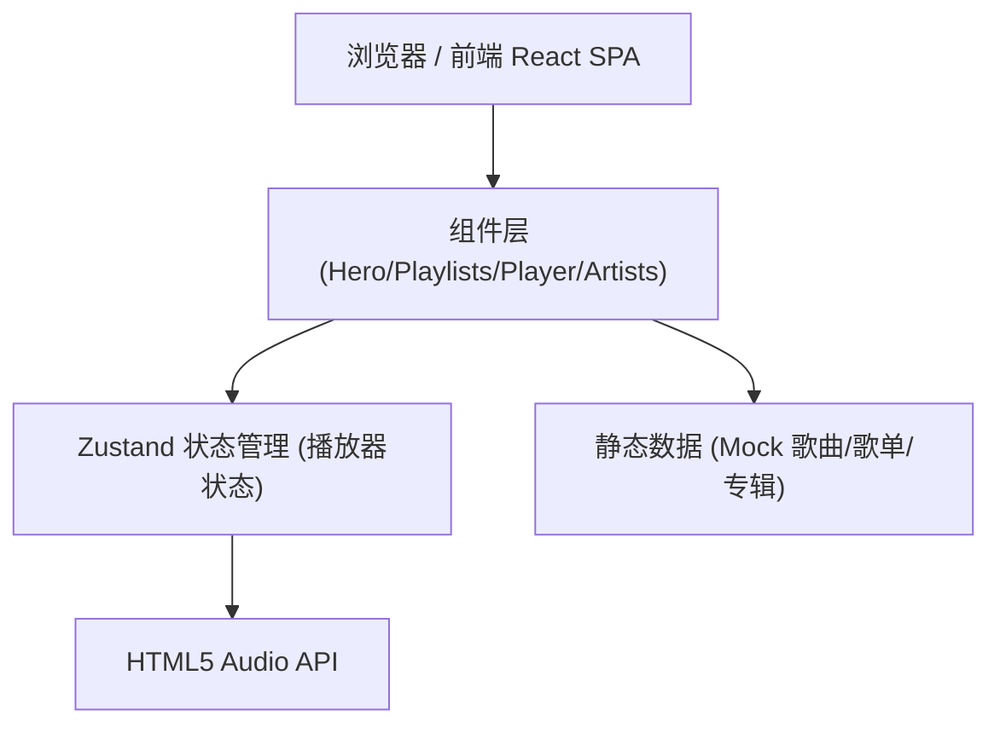

# Music - 个人音乐主页 技术架构

## 1. Architecture Design



## 2. Technology Description
- **Frontend**: React@18 + TypeScript + Vite
- **Styling**: TailwindCSS@3
- **State Management**: Zustand
- **Icons**: lucide-react
- **Audio**: HTML5 Audio API (原生，无需外部音频库)
- **字体**: Google Fonts (Playfair Display + Space Mono)
- **Backend**: None（纯前端静态页面，数据静态 mock）

## 3. Route Definitions
| Route | Purpose |
|-------|---------|
| / | 主页面（所有内容单页展示） |

## 4. 数据模型

### 4.1 Song (歌曲)
```typescript
interface Song {
  id: string;
  title: string;
  artist: string;
  album: string;
  cover: string;      // 封面图 URL
  duration: number;   // 秒
}
```

### 4.2 Playlist (歌单)
```typescript
interface Playlist {
  id: string;
  title: string;
  description: string;
  cover: string;
  songs: string[];    // song ids
}
```

### 4.3 Artist (艺术家)
```typescript
interface Artist {
  id: string;
  name: string;
  avatar: string;
  genre: string;
}
```

## 5. 组件结构

```
src/
├── App.tsx                   # 主应用
├── main.tsx                  # 入口
├── index.css                 # 全局样式 + Tailwind
├── store/
│   └── playerStore.ts        # 播放器 Zustand store
├── data/
│   └── musicData.ts          # 静态 Mock 数据
└── components/
    ├── Navbar.tsx            # 顶部导航
    ├── Hero.tsx              # Hero 区域 (当前播放)
    ├── Playlists.tsx         # 歌单网格
    ├── Artists.tsx           # 艺术家横向滚动
    ├── Player.tsx            # 底部固定播放器
    └── PlaylistCard.tsx      # 歌单卡片
```

## 6. 播放器状态设计 (Zustand)

```typescript
{
  currentSong: Song | null;
  isPlaying: boolean;
  currentTime: number;   // 当前进度 (秒)
  volume: number;        // 0 - 1
  playlist: Song[];      // 当前播放队列
  currentIndex: number;
  // actions
  play(song): void;
  toggle(): void;
  next(): void;
  prev(): void;
  seek(time): void;
  setVolume(v): void;
}
```

## 7. 技术决策说明
- 不引入后端/数据库：音乐主页作为展示型页面，静态数据足够支撑交互演示
- 使用 HTML5 Audio API：轻量，零依赖，浏览器原生支持
- Zustand 替代 Redux：极简 API，避免过度工程化
- 纯前端单页：便于部署 (Vercel/Netlify/GitHub Pages)
