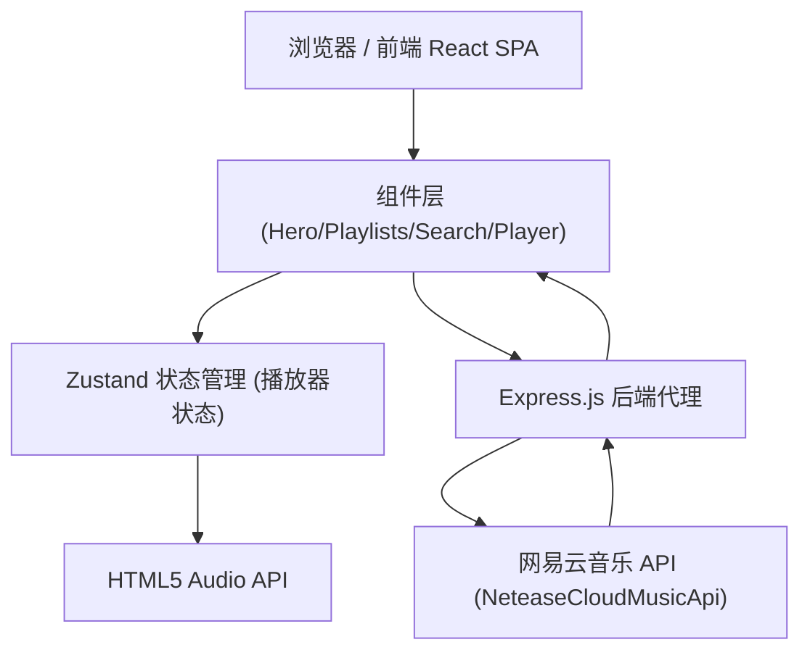

# Music - 个人音乐主页 技术架构

## 1. Architecture Design



## 2. Technology Description
- **Frontend**: React@18 + TypeScript + Vite
- **Styling**: TailwindCSS@3
- **State Management**: Zustand
- **Icons**: lucide-react
- **Audio**: HTML5 Audio API (原生)
- **字体**: Google Fonts (Playfair Display + Space Mono)
- **Backend**: Express@4 + NeteaseCloudMusicApi (网易云音乐 API)

## 3. Route Definitions

### 前端路由
| Route | Purpose |
|-------|---------|
| / | 主页面（所有内容单页展示） |

### 后端 API 路由
| Route | Method | Purpose |
|-------|--------|---------|
| /api/personalized | GET | 获取推荐歌单 |
| /api/search | GET | 搜索歌曲 (keywords) |
| /api/song/url | GET | 获取歌曲真实播放 URL (id) |
| /api/song/detail | GET | 获取歌曲详情 (ids) |
| /api/playlist/detail | GET | 获取歌单详情 (id) |
| /api/lyric | GET | 获取歌词 (id) |

## 4. 数据模型

```typescript
interface Song {
  id: string;
  name: string;
  artist: string;
  album: string;
  picUrl: string;
  duration: number; // ms
  url?: string;
}

interface Playlist {
  id: string;
  name: string;
  description: string;
  coverImgUrl: string;
  playCount?: number;
  trackIds?: number[];
}

interface SearchResult {
  songs: Song[];
}
```

## 5. 组件结构

```
src/
├── App.tsx
├── main.tsx
├── index.css
├── store/
│   └── playerStore.ts
├── utils/
│   └── api.ts
└── components/
    ├── Navbar.tsx
    ├── Hero.tsx
    ├── Playlists.tsx
    ├── PlaylistCard.tsx
    ├── SearchBar.tsx
    ├── SearchResults.tsx
    ├── HotSongs.tsx
    └── Player.tsx

api/
└── server.ts          # Express 代理服务器
```

## 6. 后端架构

```
Express Server (:3001)
  ├─ cors + json 中间件
  ├─ 所有 /api/* 路由代理到 NeteaseCloudMusicApi
  └─ Vite dev server 代理到 Express (用于部署合一)
```

使用 `NeteaseCloudMusicApi` 官方 Node 包直接请求网易云接口。

## 7. 播放器状态设计 (Zustand)

```typescript
{
  currentSong: Song | null;
  isPlaying: boolean;
  currentTime: number;
  duration: number;
  volume: number;
  playlist: Song[];
  currentIndex: number;
  play(song, playlist?): void;
  toggle(): void;
  next(): void;
  prev(): void;
  seek(time): void;
  setVolume(v): void;
  setCurrentTime(t): void;
  setDuration(d): void;
}
```
