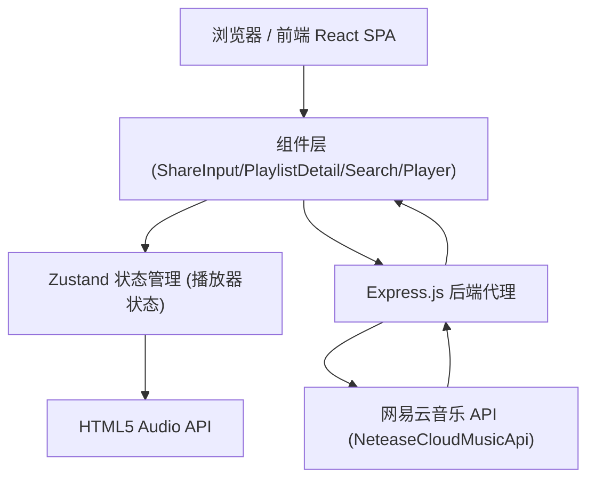

# Music - 个人音乐主页 技术架构

## 1. Architecture Design



## 2. Technology Description
- **Frontend**: React@18 + TypeScript + Vite
- **Styling**: TailwindCSS@3
- **State Management**: Zustand
- **Icons**: lucide-react
- **Audio**: HTML5 Audio API (原生)
- **字体**: Google Fonts (Playfair Display + Space Mono)
- **Backend**: Express@4 + NeteaseCloudMusicApi (网易云音乐 API)

## 3. Route Definitions

### 前端路由
| Route | Purpose |
|-------|---------|
| / | 主页面（所有内容单页展示） |

### 后端 API 路由
| Route | Method | Purpose |
|-------|--------|---------|
| /api/parse/share | GET | 解析网易云分享 URL，获取歌曲/歌单信息 |
| /api/personalized | GET | 获取推荐歌单 |
| /api/search | GET | 搜索歌曲 (keywords) |
| /api/song/url | GET | 获取歌曲真实播放 URL (id) |
| /api/song/detail | GET | 获取歌曲详情 (ids) |
| /api/playlist/detail | GET | 获取歌单详情 (id) |
| /api/playlist/track/all | GET | 获取歌单全部歌曲 (id) |
| /api/lyric | GET | 获取歌词 (id) |
| /api/toplist | GET | 获取排行榜 |

## 4. 数据模型

```typescript
interface Song {
  id: number;
  name: string;
  artists: { id: number; name: string }[];
  album: { id: number; name: string; picUrl: string };
  duration: number;
  url?: string;
}

interface Playlist {
  id: number;
  name: string;
  coverImgUrl: string;
  description?: string;
  playCount?: number;
  trackCount?: number;
}

interface ParsedShare {
  type: 'song' | 'playlist' | 'album';
  id: number;
  name?: string;
}
```

## 5. 组件结构

```
src/
├── App.tsx
├── main.tsx
├── index.css
├── store/
│   └── playerStore.ts
├── utils/
│   └── api.ts
└── components/
    ├── Player.tsx
    ├── SearchPanel.tsx
    ├── PlaylistCard.tsx
    ├── PlaylistDetail.tsx
    └── ShareInput.tsx

api/
└── app.ts              # Express 代理服务器
```

## 6. 播放器状态设计 (Zustand)

```typescript
{
  currentSong: Song | null;
  isPlaying: boolean;
  currentTime: number;
  duration: number;
  volume: number;
  playlist: Song[];
  currentIndex: number;
  playSong(song, playlist?): void;
  toggle(): void;
  next(): void;
  prev(): void;
  seek(time): void;
  setVolume(v): void;
  setCurrentTime(t): void;
  setDuration(d): void;
}
```

## 7. 网易云分享 URL 解析

分享 URL 格式：
- 歌曲：`https://music.163.com/song?id=123456`
- 歌单：`https://music.163.com/playlist?id=123456`
- 专辑：`https://music.163.com/album?id=123456`

解析逻辑：
1. 从 URL 中提取 id 参数
2. 根据路径判断类型（song/playlist/album）
3. 调用对应 API 获取详细信息
